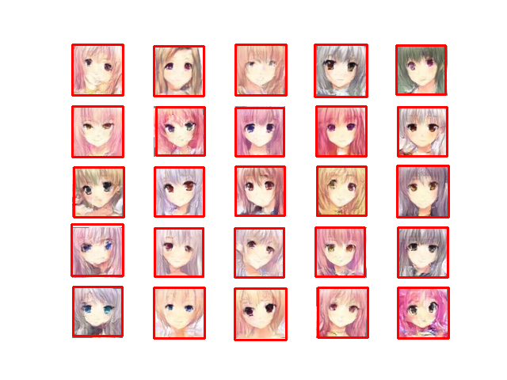
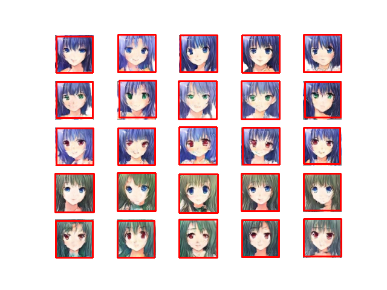

# MLDS2018SPRING
## Description
Machine Learning and having it deep and structured (MLDS) at NTU 2018 Spring.

This repo includes codes of projects in the MLDS course, NTU. The four projects are about:
   1. Deep Learning Theory
   2. Sequence-to-sequence Model
   3. Generative Aderverial Model
   4. Deep Reinforcement Learning

For more details, please browse this [course website](http://speech.ee.ntu.edu.tw/~tlkagk/courses_MLDS18.html).

## Table of Contents
   1. Deep Learning Theory
      * Deep vs Shallow
      * Optimization
      * Generalization
   2. Sequence-to-sequence Model
      * Video caption generationhw2_1
      * Chat-bot
   3. Deep Generative Model
      * Image Generation
      * Text-to-Image Generation
      * Style Transfer
   4. Deep Reinforcement Learninghw4
      * Policy Gradient
      * Deep Q Learning
      * Actor-Critic

## Task visualization
#### 3.1 Image Generation

   
### 3.2 Text-to-Image Generation
   | Testing Tags |./images/cgan.png|
   |:------------:|:-------------------------------------:|
   |blue hair blue eyes   blue hair green eyes   blue hair red eyes   green hair blue eyes   green hair red eyes||

#### 4. Deep Reinforcement Learning
* Pong

* Breakout

